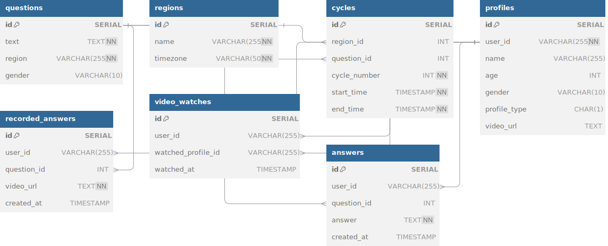
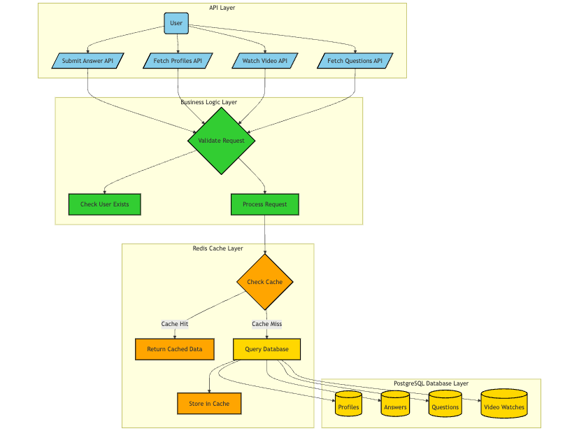
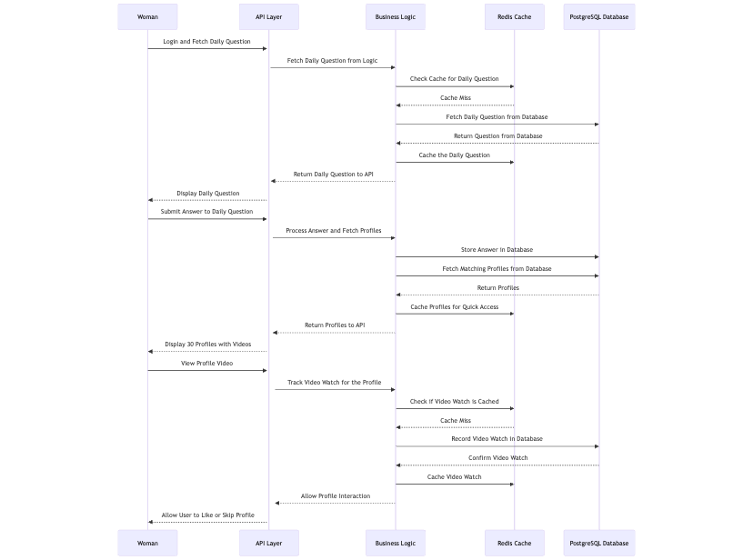
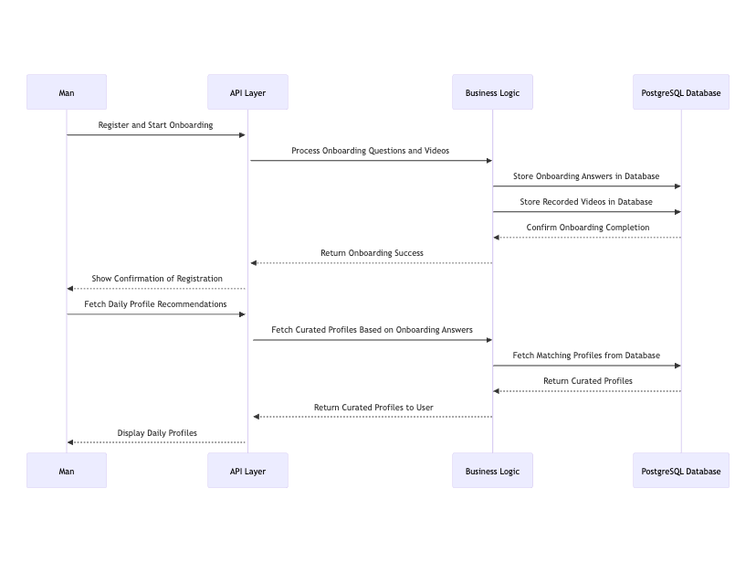

# Crystal Ball Feature - Matchmaking App

## Problem Statement

The **Crystal Ball feature** is a matchmaking system designed for an app that connects men and women. The unique twist involves daily interactions where women answer a random question to view profiles of men, and men answer onboarding questions and submit videos that influence their profile recommendations.

## Approach

1. **Problem Breakdown**:
   - We split the project into two main user journeys: **Women’s journey** (daily questions, video views, profile interactions) and **Men’s journey** (onboarding, daily profile recommendations).
   - Each interaction is tied to key APIs that handle requests, such as fetching daily questions, submitting answers, viewing videos, and fetching profiles.

2. **Caching and Optimization**:
   - **Redis** is used to cache frequently accessed data (e.g., daily questions, profiles, user answers) to improve performance and reduce database load.

3. **Modular API Design**:
   - Each functionality is exposed via specific APIs. These APIs interact with the **PostgreSQL database** for persistence and **Redis** for caching.

## Assumptions

- Women must answer a daily question and watch a man’s video before interacting with his profile.
- Men’s profile recommendations are based on their onboarding answers and are curated daily.
- The app supports user-specific cycles (daily or weekly) for fetching questions and profiles.
- The system is designed to scale for a large number of users with optimized database queries and caching layers.

## Database

## User Journeys

### **Women’s Journey**:

- **Login and Get Daily Question**: Upon login, a woman receives a random daily question to answer.
- **Answer the Question**: Once the woman submits her answer, the system fetches 30 men’s profiles (15 Type A, 15 Type B).
- **Watch Video and Interact**: The woman must watch a 10-15 second video for each man before liking or skipping their profile.

### **Men’s Journey**:

- **Onboarding**: Men answer 7 onboarding questions and submit video recordings.
- **Daily Profile Recommendations**: Based on the onboarding answers, men receive daily profile recommendations.

## App Architecture

The app is divided into four primary layers:
1. **API Layer**: Handles user requests and returns responses.
2. **Business Logic Layer**: Processes the core logic for matchmaking, profile fetching, and more.
3. **Cache Layer**: Uses **Redis** to cache frequently accessed data (daily questions, profiles, etc.).
4. **Database Layer**: **PostgreSQL** stores all persistent data, including profiles, answers, video watches, and questions.

**Architecture Diagram Placeholder**

## Sequence Diagrams

### **Women’s User Journey**:

**Women’s Journey Sequence Diagram Placeholder**

1. **Login and Fetch Daily Question**: 
   - The woman logs in and fetches a daily question, which is checked in **Redis** cache first. If not cached, it is fetched from the database and then cached.
   - **API**: `/questions/cycle`

2. **Submit Answer to Daily Question**:
   - The woman submits her answer, and based on the answer, 30 profiles (15 Type A, 15 Type B) are fetched from the database and cached for quick access.
   - **API**: `/answers`

3. **View Profile Video**:
   - The woman must watch the video of a profile before interacting (like/skip). The video watch is tracked in the database, and the profile is unlocked for interaction after the video is watched.
   - **API**: `/videos/watched`

---

### **Men’s User Journey**:

**Men’s Journey Sequence Diagram Placeholder**

1. **Onboarding**: 
   - The man registers and answers the 7 onboarding questions while recording videos for each answer. This data is stored in the database.
   - **API**: `/onboarding`

2. **Daily Profile Recommendations**:
   - Based on the onboarding answers, the man receives daily profile recommendations. These profiles are curated and fetched from the database based on his preferences and responses.
   - **API**: `/profiles`

---

## API Endpoints

- **/questions/cycle**: Fetch the daily question for women based on their region and cycle.
- **/answers**: Submit the woman's answer and fetch matching profiles.
- **/videos/watched**: Track the woman's video watch for a profile.
- **/profiles**: Fetch curated profiles for men and women.
- **/onboarding**: Handle the onboarding process for men.
- **/likes**: Track and check for mutual likes between users.

## Postman Collection

You can access all the APIs for the Crystal Ball feature via the Postman collection:

---
